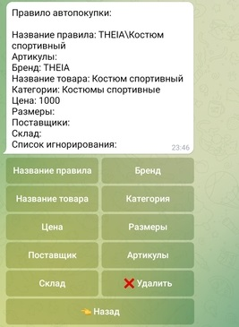
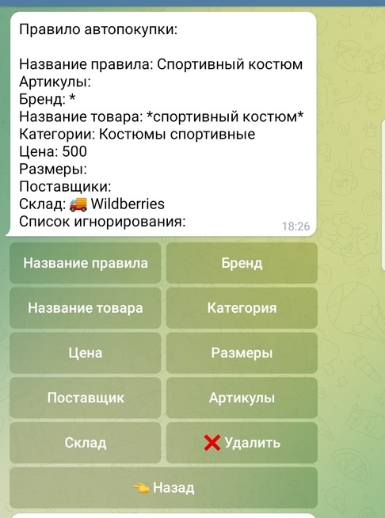

# Автовыкуп лайт версия
Мы, как и прежде, **не оказываем помощь с настройкой автовыкупа**, но вместе с тем, хотели бы попробовать упросить жизнь, и вам, и нам посредством графической подачи информации. Данная ветка FAQ должна помочь лучше разобраться тем, кто только к нам присоединился и, возможно тем, кто с нами уже давно. Автовыкуп в лайт версии является урезанным, но как только вы поймете логику, то смело можете переходить к более расширенной настройке, описанной здесь [тык](/autobot_faq/). А пока приступим?

## Как настроить автовыкуп? С чего начать?
## Шаг 1. Зайти в королевского стражника и прислать ему ссылку
У нас есть бот - его зовут Королевский стражник [тык на стражника](https://t.me/king_gatekeeper_bot), в нем хранится вся информация и настройки для Вашего аккаунта. Для того, чтобы добавить правило автовыкупа нам нужно перейти Настройки-> Магия->Новое правило (смотри Рисунок 1)

  
Рисунок 1

Сегодня мы будем создавать и рассматривать правило автовыкупа на спортивный костюм.
Прежде всего, нам необходимо в поиске на сайте wildberries ввести словосочетание "спортивный костюм" [тык](https://www.wildberries.ru/catalog/0/search.aspx?sort=popular&search=%D1%81%D0%BF%D0%BE%D1%80%D1%82%D0%B8%D0%B2%D1%8B%D0%BD%D0%B9+%D0%BA%D0%BE%D1%81%D1%82%D1%8E%D0%BC) и открыть совершенно любую карточку, которая выпала в поиске. Обратите внимание, что ссылка должна быть не на все костюмы, которые открылись по поиску, а только на один нами выбранный [тык](https://www.wildberries.ru/catalog/23408032/detail.aspx?targetUrl=GP). Мы копируем ссылку и отправляем ее стражнику [тык на стражника](https://t.me/king_gatekeeper_bot), затем нажимаем кнопку назад.
Мы вернулись назад и видим перед собой только что созданное правило автопокупки (смотри Рисунок 2), но его нужно доработать.

  
Рисунок 2

## Шаг 2. Называем правило
Сначала нажимаем на кнопку "Название правила" и называем наше правило так, как будет удобнее нам в дальнейшем найти его среди других нами созданных правил. Обратите внимание, что название правила не влияет на автопокупку, вы можете обозвать правило как угодно.

## Шаг 3. Указываем или не указываем бренд
Нажимаем на кнопку "Бренд". Если вам необходимо, что бы при автопокупке выкупалась определенная марка/бренд костюма, то вписываем необходимый бренд, если же нет, то ставим ```*```  
Символ ```*``` обозначает то, что выкупаться будет любой бренд.

## Шаг 4. Прописываем название товара
Название товара. Нажимаем на кнопку "Название товара". Название товара напрямую ВЛИЯЕТ на автопокупку, в лайт версии FAQ мы рассмотрим четыре варианта написания правила (в полной версии их несколько больше )


### Вариант 1. Название товара в правиле - ```Костюм спортивный```
  

### Вариант 2. Название товара в правиле  - ``` *костюм спортивный* ```
  

### Вариант 3. Название товара в правиле - ``` *костюм спортивный```
  

### Вариант 4. Название товара в правиле - ```Костюм спортивный* ```
  

Не забывайте о том, что на совершение ботом автопокупки влияет так же бренд, если он был выбран, категория, цена и склад

## Шаг 5. Категория товара
Нажимаем на кнопку "Категория товара". По умолчанию, стражник сам определяет верную категорию, если вы правильно выслали ему ссылку на Шаге 1 и менять ее необходимости нет, но если вы считаете, что категория не нужна вообще - ставим ```*```. Обратите внимание, указывая символ ```*``` в правиле, что в данном случае обозначает "любая категория", "все категории", вы даете стражнику указание выкупать товар из всех категории, которые будут подходить под название товара, стоимость, бренд и склад, если таковые были прописаны.

## Шаг 6. Проставляем цену
Нажимаем на кнопку "Цена". Необходимый ценовой диапазон вы определяете самостоятельно, он начинается от 0 и задается цифрой. НЕ нужно в правиле прописывать цену таким образом: 500 рублей - рубли по умолчанию опускаются. Цена пишется только цифрой без ```*```, то есть ```100*``` или ```*100``` неверно

## Шаг 7. Выбор размера
Нажимаем на кнопку "Размеры". Выбор размеров это ПОЖЕЛАНИЕ, это не фильтр и не поиск и не список отсечения, если ваш размер будет в наличии - бот постарается купить его, если нет - будет выкуплен любой размер

## Шаг 8. Выбор склада
Нажимаем на кнопку "Склад". Вы можете указать приоритет выкупа - со склада wildberries или со склада продавца. Не выбирайте ОБА склада - просто снимите с них галочки, если хотите убрать фильтрацию совсем

## Шаг 9. Нажать на кнопку включить
После всех настроек вашего правила, не забудьте включить автовыкуп, нажав на кнопку "Включить"(смотри Рисунок 3). По умолчанию автовыкуп выключен

  
Рисунок 3

***Категории поставщик и артикул в версии лайт настраивать не нужно, пока вы не разберетесь с базовой настройкой***

## Королевский ловец
Для вашего удобства мы создали бота, который будет в отдельный чат присылать оповещения при автовыкупе [ссылка на бот](https://t.me/king_fisher_bot). Королевский стражник и королевский ловец это разные боты :). Для запуска необходимо отправить следующее сообщение королевскому ловцу: /start (смотри Рисунок 4)

  
Рисунок 4

## Игнорировать, проверить товар и отменить товар
Когда ваше правило автовыкупа сработает и бот попытается выкупить товар, то вы увидите перед собой две кнопки - Проверить и Игнорировать товар

Рисунок 5, как это будет примерно выглядеть.

  
Рисунок 5

Если при нажатии кнопки "Проверить" вы получите сообщение, что "Заказ не найден":-повторите нажатие через 10-20 секунд-если повторно выдаст такое же сообщение "заказ не найден"-это означает, что товара нет в доставках - проверяйте раздел "покупки", вероятнее всего, товар в статусе "отмена магазином"


Если появилась кнопка "Отменить" - Ваш заказ принят системой wildberries в обработку, если кнопки нет - вероятнее всего Ваш заказ отменен магазином или в статусе ожидается

Кнопка "Игнорировать товар" отвечает за перенос артикула товара в список игнорирования, т.е товар не будет куплен повторно, если он появится вновь в боте.
Обратите внимание, бот выкупит такой же товар, если на wildberries он был указан под другим артикулом.
Пример: у платья размерной сетки от XS до L указан артикул 0000 - мы нажали кнопку игнорировать товар, через час в боте появилось это же платье размера XL c артикулом 0001 - бот выкупит этот товар.


Если вы случайно нажали на кнопку "игнорировать", то товар можно удалить из этого списка, только удалив правило и добавив его заново, будьте внимательны!

## Пример рабочего правила
Напоследок, покажем вам верное, рабочее правило - оно не обязательно у вас должно быть точно такое же: на свое усмотрение вы можете менять цену, название правила, название товара, склад и указывать или не указывать бренд. Смотри Рисунок 6

  
Рисунок 6


Все :)
Вы прошли обучение лайт версии настройки автовыкупа. Вы прекрасны!

Автор текста @richerries.
